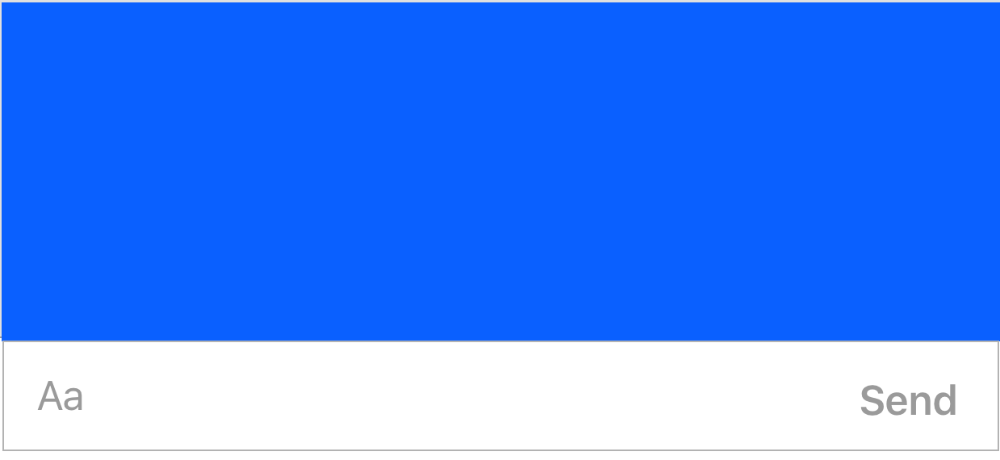

# Getting Started

## AutocompleteManager

The `AutocompleteManager` holds the logic and views required for the autocomplete functionality which makes it easy to subclass and modify if you wish to add additional logic! Then you can set the `InputBarAccessoryView`'s autocompleteManager property to your own

### Customization

```swift
/// If the autocomplete matches should be made by casting the strings to lowercase.
/// Default value is `FALSE`
open var isCaseSensitive = false
    
/// Adds an additional space after the autocompleted text when true.
/// Default value is `TRUE`
open var appendSpaceOnCompletion = true
    
/// Keeps the prefix typed when text is autocompleted.
/// Default value is `TRUE`
open var keepPrefixOnCompletion = true
    
/// The prefices that the manager will recognize
/// Default value is `["@"]`
open var autocompletePrefixes: [Character] = ["@"]
    
/// The delimiters that cause a current autocomplete session to become invalidated when typed.
/// Default value is `[" ", "\n"]`
open var autocompleteDelimiters: [Character] = [" ", "\n"]
    
/// The default text attributes
open var defaultTextAttributes: [NSAttributedStringKey: Any] =
    [.font: UIFont.preferredFont(forTextStyle: .body), .foregroundColor: UIColor.black]
    
/// The text attributes applied to highlighted substrings for each prefix
/// Default value applys blue tint highlighting to the `@` prefix
open var autocompleteTextAttributes: [Character: [NSAttributedStringKey: Any]] =
    ["@": [.font: UIFont.preferredFont(forTextStyle: .body),
           .foregroundColor: UIColor(red: 0, green: 122/255, blue: 1, alpha: 1),
           .backgroundColor: UIColor(red: 0, green: 122/255, blue: 1, alpha: 0.1)]]
```

### AutocompleteManagerDataSource

By default an `AutocompleteCell` is returned to the `AutocompleteManager` that's title labels text is bolded to match the entered text.

```swift
/// The autocomplete options for the registered prefix.
func autocompleteManager(_ manager: AutocompleteManager, autocompleteSourceFor prefix: Character) -> [AutocompleteCompletion]
    
/// The cell to populate the `AutocompleteTableView` with 
func autocompleteManager(_ manager: AutocompleteManager, tableView: UITableView, cellForRowAt indexPath: IndexPath, for session: AutocompleteSession) -> UITableViewCell
```

### AutocompleteManagerDelegate

```swift
/// Can be used to determine if the AutocompleteManager should be inserted into 
func autocompleteManager(_ manager: AutocompleteManager, shouldBecomeVisible: Bool)
```

## Attachment Manager

The `AttachmentManager` is an easy way to display images or other additional content above the `InputTextView`

```swift
public enum Attachment {
    case image(UIImage)
    case url(URL)
    case data(Data)
    case other(AnyObject)
}
```

### Customization

```swift
/// A flag you can use to determine if you want the manager to be always visible
open var isPersistent = false { didSet { attachmentView.reloadData() } }
    
/// A flag to determine if the AddAttachmentCell is visible
open var showAddAttachmentCell = true { didSet { attachmentView.reloadData() } }
``` 

### Usage

```swift
/// Performs an animated insertion of an attachment at an index
open func insertAttachment(_ attachment: Attachment, at index: Int)
    
/// Performs an animated removal of an attachment at an index
open func removeAttachment(at index: Int)
```

### AttachmentManagerDelegate

```swift
/// Can be used to determine if the AttachmentManager should be inserted into an InputStackView
func attachmentManager(_ manager: AttachmentManager, shouldBecomeVisible: Bool) 
```

### AttachmentManagerDataSource

```swift    
/// The AttachmentCell for the attachment that is to be inserted into the AttachmentView
func attachmentManager(_ manager: AttachmentManager, cellFor attachment: AttachmentManager.Attachment, at index: Int) -> AttachmentCell
```


## InputBarButtonItem

It is recommended that you use the `InputBarButtonItem` for the `InputStackView `'s. This is because all `InputStackView`'s size their arranged subviews based on intrinsicContentSize:

This will layout the arrangedViews based on their intrinsicContentSize and if there is extra space the views will be expanded based on their content hugging `UILayoutPriority`.

### Size

Each `InputBarButtonItem`'s `intrinsicContentSize` can be overridden by setting the `size` property. It is optional so when set to `nil` the `super.intrinsicContentSize` will be used. 

### Spacing

Spacing can be set using the `spacing` property. This will change the content hugging `UILayoutPriority` and add extra space to the `intrinsicContentSize` when set to `.fixed(CGFloat)`.

## InputBarAccessoryViewDelegate

```swift
func inputBar(_ inputBar: InputBarAccessoryView, didPressSendButtonWith text: String)

// Useful for updating a UICollectionView or UITableView bottom inset    
func inputBar(_ inputBar: InputBarAccessoryView, didChangeIntrinsicContentTo size: CGSize)
    
func inputBar(_ inputBar: InputBarAccessoryView, textViewTextDidChangeTo text: String)
    
func inputBar(_ inputBar: InputBarAccessoryView, didSwipeTextViewWith gesture: UISwipeGestureRecognizer)
```