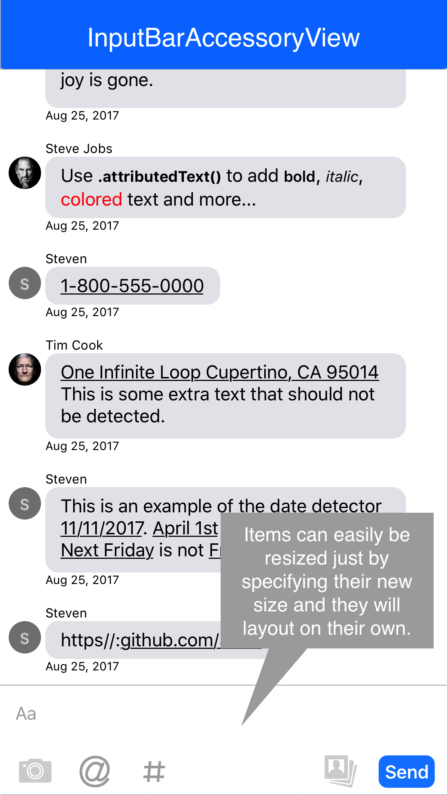
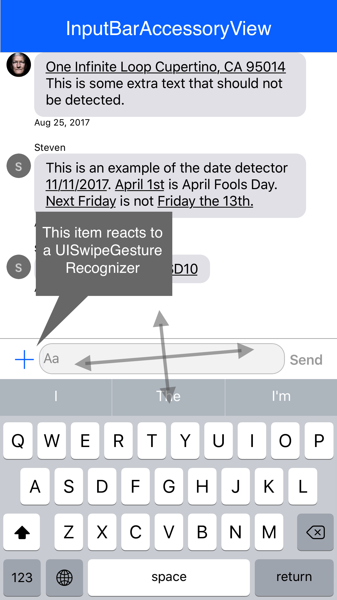
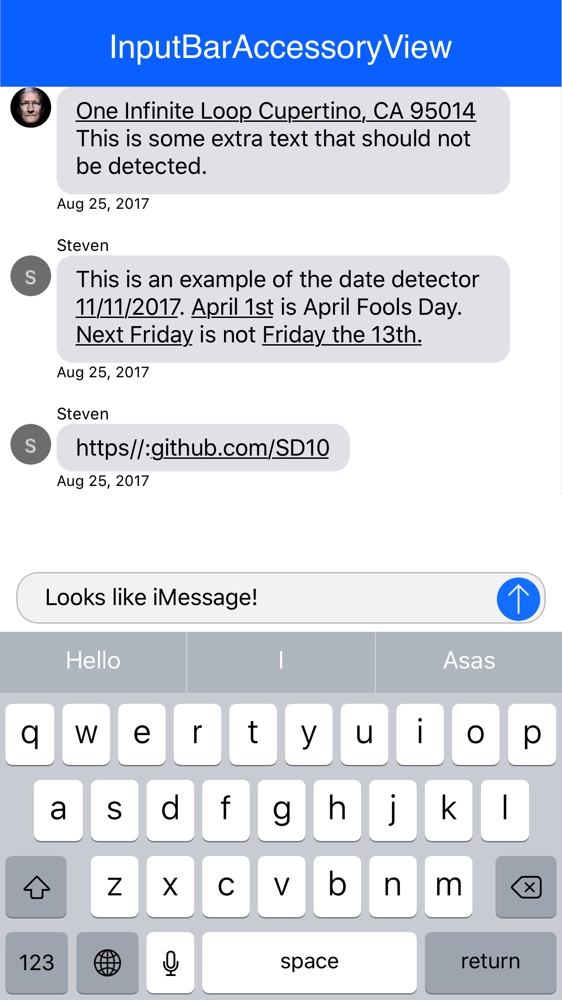

# InputBarAccessoryView


### Installation via CocoaPods

```ruby
pod 'InputBarAccessoryView'
```

### Installation via Carthage

```ruby
github "nathantannar4/InputBarAccessoryView"
```

### Usage

Add your app to the list of apps using this library and make a pull request.

- [MessageKit](https://github.com/MessageKit/MessageKit) *(renamed to MessageInputBar)*
<p>
  
</p>

### Requirements

iOS 9.0+
Swift 4
XCode 9.0+

### Documentation

[Jazzy Generated Docs](https://nathantannar.me/InputBarAccessoryView/docs/)

### Screenshots

     

## Layout

The layout of the `InputBarAccessoryView` is made of of 4  `UIStackView`'s and an `InputTextView` (subclass of `UITextView`). The padding of the subviews can be easily adjusted by changing the `padding` and `textViewPadding` properties. The constraints will automatically be updated.


It is important to note that each of the `UIStackView`'s to the left and right of the `InputTextView` are anchored by a width constraint. This way the `InputTextView` will always fill the space inbetween in addition to providing methods that can easily be called to hide all buttons to the right or left of the `InputTextView` by setting the width constraint constant to 0. The bottom and top stack views are not height constraint and rely on their `intrinsicContentSize`

```swift
func setLeftStackViewWidthConstant(to newValue: CGFloat, animated: Bool)

func setRightStackViewWidthConstant(to newValue: CGFloat, animated: Bool)
```


## AutocompleteManager

The `AutocompleteManager` holds the logic and views required for the autocomplete functionality which makes it easy to subclass and modify if you wish to add additional logic! Then you can set the `MessageInputBar`'s autocompleteManager property to your own

```swift
/// If the autocomplete matches should be made by casting the strings to lowercase
open var isCaseSensitive = false
    
/// When TRUE, autocompleted text will be highlighted with the UITextView's tintColor with an alpha component
open var highlightAutocompletes = true
    
/// The max visible rows visible in the autocomplete table before the user has to scroll throught them
open var maxVisibleRows = 3
    
/// The prefices that the manager will recognize
open var autocompletePrefixes: [Character] = ["@","#"]
```

### AutocompleteManagerDataSource

By default an `AutocompleteCell` is returned to the `AutocompleteManager` thats title labels text is bolded to match the entered text.

```swift
// The autocomplete options for a given prefix. Called once when a prefix is entered and then cached until the prefix is unregistered
func autocomplete(_ autocompleteManager: AutocompleteManager, autocompleteTextFor prefix: Character) -> [String]
    
// Configure the cell to display in the `UITableView`
func autocomplete(_ autocompleteManager: AutocompleteManager, tableView: UITableView, cellForRowAt indexPath: IndexPath, for arguments: (char: Character, filterText: String, autocompleteText: String)) -> UITableViewCell
```

### AutocompleteManagerDelegate

```swift
func autocomplete(_ autocompleteManager: AutocompleteManager, didComplete prefix: Character, with text: String)
```

## InputBarButtonItem

It is recommended that you use the `InputBarButtonItem` for the `UIStackView`'s. This is because all `UIStackView`'s are intitially set with the following properties:

```swift
let view = UIStackView()
view.axis = .horizontal
view.distribution = .fill
view.alignment = .fill
view.spacing = 15
```

This will layout the arrangedViews based on their intrinsicContentSize and if there is extra space the views will be expanded based on their content hugging `UILayoutPriority`.

### Size

Each `InputBarButtonItem`'s `intrinsicContentSize` can be overridden by setting the `size` property. It is optional so when set to `nil` the `super.intrinsicContentSize` will be used. 

### Spacing

Spacing can be set using the `spacing` property. This will change the content hugging `UILayoutPriority` and add extra space to the `intrinsicContentSize` when set to `.fixed(CGFloat)`.


### Hooks

Each `InputBarButtonItem` has properties that can hold actions that will be executed during various hooks such as the button being touched, the `UITextView `text changing and more! Thanks to these easy hooks with a few lines of code the items can be easily resized and animated similar to that of the Facebook messenger app.

```swift
// MARK: - Hooks
    
public typealias InputBarButtonItemAction = ((InputBarButtonItem) -> Void)    
    
private var onTouchUpInsideAction: InputBarButtonItemAction?
private var onKeyboardEditingBeginsAction: InputBarButtonItemAction?
private var onKeyboardEditingEndsAction: InputBarButtonItemAction?
private var onKeyboardSwipeGestureAction: ((InputBarButtonItem, UISwipeGestureRecognizer) -> Void)?
private var onTextViewDidChangeAction: ((InputBarButtonItem, InputTextView) -> Void)?
private var onSelectedAction: InputBarButtonItemAction?
private var onDeselectedAction: InputBarButtonItemAction?
private var onEnabledAction: InputBarButtonItemAction?
private var onDisabledAction: InputBarButtonItemAction?
```

## InputBarAccessoryViewDelegate

```swift
func inputBar(_ inputBar: InputBarAccessoryView, didPressSendButtonWith text: String)

// Useful for updating a UICollectionView or UITableView bottom inset    
func inputBar(_ inputBar: InputBarAccessoryView, didChangeIntrinsicContentTo size: CGSize)
    
func inputBar(_ inputBar: InputBarAccessoryView, textViewTextDidChangeTo text: String)
    
func inputBar(_ inputBar: InputBarAccessoryView, didSwipeTextViewWith gesture: UISwipeGestureRecognizer)
```

Have a suggestion? Make a PR!

## Changelog

- 1.4.0
        - iPhone X Fixes
        - IntrinsicContentSize caching to increase performance
        - Auto Manage maxTextViewHeight
- 1.3.0
        - iPhone X Fixes
- 1.2.0
        - Better XCode docs
        - `InputItem` is now a protocol that you can give to the `InputBarAccessoryView`
        - `InputManager` is now a protocol that you can conform to make a plugin
        - `AutocompleteManager` and `AttactchmentManager` are no longer members of  `InputBarAccessoryView` by default. You will need to create them and assign them to the `inputManager` property of the `InputBarAccessoryView`
- 1.1.2
        - Fixed issue where adjusting the `InputTextView`'s placeholder text alignment didn't work
        - Fixed iPhone X support where the home indicator overlapped the `InputTextView`
- 1.1.1
        - AutocompleteManager bug fixes and customization improvements
- 1.1.0
        - AttactchmentManager (Beta)
- 1.0.0
	- A more refined AutocompleteManager
	- Auto-layout bug fixes

*pre-release versions not documented*

**Find a bug? Open an issue!**

## Author
<p>
	
</p>

**Nathan Tannar** - [https://nathantannar.me](https://nathantannar.me)

## License

Distributed under the MIT license. See ``LICENSE`` for more information.
