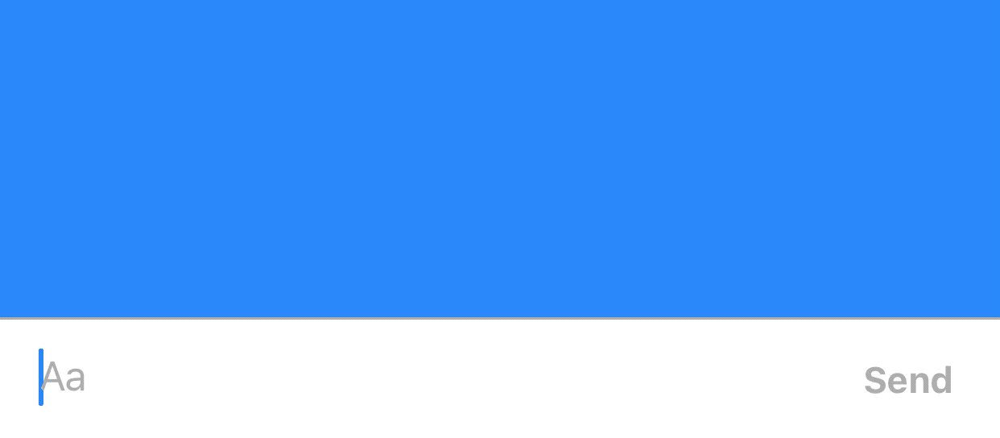

[]()

# InputBarAccessoryView

### Features

- [x] Autocomplete text with @mention, #hashtag or any other prefix 
- [x] A self-sizing `UITextView` with an optional fixed height (can be replaced with any other view)
- [x] Image paste support   
- [x] Autocomplete attributed text highlighting
- [x] Reactive components that respond to given events
- [x] Top/Bottom/Left/Right `InputStackView`s that act as toolbars to place buttons
- [x] `RxSwift`/`RxCocoa` Support
- [x] Drop in attachment view for file/photo management
- [x] Plugin support for your own `InputPlugin`s
- [x] Compatible with all iPhones and iPads
- [x] RTL Support

### Installation via CocoaPods

```ruby
pod 'InputBarAccessoryView'
```

### Installation via Carthage

```ruby
github "nathantannar4/InputBarAccessoryView"
```

### Requirements

iOS 9.0+
Swift 4.2+
XCode 9.0+

### Documentation

[Getting Started](./GETTING_STARTED.md)

> See the Example project to see how you can make the iMessage, Slack, Facebook and GitHawk input bars!

### Example Usage

     

### Featured In

Add your app to the list of apps using this library and make a pull request.

- [MessageKit](https://github.com/MessageKit/MessageKit) *(renamed to MessageInputBar)*
<p>
  
</p>

- [MessageViewController](https://github.com/GitHawkApp/MessageViewController) *(Autocomplete Highlighting Algorithm)*
<p>
  
</p>

### See Also

iMessage style [TypingIndicator](https://github.com/nathantannar4/TypingIndicator) for chat apps

## Latest Releases

- 4.2.1
    - Fixed autocompletes of completions that contain spaces
    - Depricated `isCaseSensitive` in favor of a function asignment to pre-process autocompletions
- 4.2.0
    - Added new API for overriding the main middle view, normally the `InputTextView` so it can be replaced with views such as a "Join" button", `setMiddleContentView(_ view: UIView?, animated: Bool)`
- 4.1.2
        - Add RxSwift/RxCocoa support through extensions and delegate proxies in `RxInputBarAccessoryView`, requires `RxSwift` and `RxCocoa`
        - Add `InputBarViewController` which contains an `InputBarAccessoryView` as the `inputAccessoryView` by default with a convenient `isInputBarHidden: Bool` property to show/hide it 
- 4.1.1
        - Add `frameInsets: HorizontalEdgePadding` property to `InputBarAccessoryView` to inset the view to be compatible with `UISplitViewController` or other custom containers where the view should not be the full width
- 4.1.0
        - Fix issue where setting long strings in `viewDidLoad` broke inital layout, Issue #41
        - Add `deleteCompletionByParts: Bool` flag to `AutocompleteManager` to allow for partial deletions of autocompletes rather than just the entire substring. 
        - Add `InputBarSendButton` to use as the `sendButton` in `InputBarAccessoryView`. This subclass of `InputBarButtonItem` has a `UIActivityIndicatorView` to show a spinner when making HTTP requests

### [CHANGELOG](./CHANGELOG.md)

**Find a bug? Open an issue!**

## Layout

The layout of the `InputBarAccessoryView` is made of of 4  `InputStackView`'s and an `InputTextView`. The padding of the subviews can be easily adjusted by changing the `padding` and `textViewPadding` properties. The constraints will automatically be updated.


It is important to note that each of the `InputStackView `'s to the left and right of the `InputTextView` are anchored by a width constraint. This way the `InputTextView` will always fill the space inbetween in addition to providing methods that can easily be called to hide all buttons to the right or left of the `InputTextView` by setting the width constraint constant to 0. The bottom and top stack views are not height constraint and rely on their `intrinsicContentSize`

```swift
func setLeftStackViewWidthConstant(to newValue: CGFloat, animated: Bool)

func setRightStackViewWidthConstant(to newValue: CGFloat, animated: Bool)
```

### Reactive Hooks

Each `InputBarButtonItem` has properties that can hold actions that will be executed during various hooks such as the button being touched, the `UITextView `text changing and more! Thanks to these easy hooks with a few lines of code the items can be easily resized and animated similar to that of the Facebook messenger app.

```swift
// MARK: - Hooks
    
public typealias InputBarButtonItemAction = ((InputBarButtonItem) -> Void)    
    
private var onTouchUpInsideAction: InputBarButtonItemAction?
private var onKeyboardEditingBeginsAction: InputBarButtonItemAction?
private var onKeyboardEditingEndsAction: InputBarButtonItemAction?
private var onKeyboardSwipeGestureAction: ((InputBarButtonItem, UISwipeGestureRecognizer) -> Void)?
private var onTextViewDidChangeAction: ((InputBarButtonItem, InputTextView) -> Void)?
private var onSelectedAction: InputBarButtonItemAction?
private var onDeselectedAction: InputBarButtonItemAction?
private var onEnabledAction: InputBarButtonItemAction?
private var onDisabledAction: InputBarButtonItemAction?
```

## Author
<p>
	
</p>

**Nathan Tannar** - [https://nathantannar.me](https://nathantannar.me)

## License

Distributed under the MIT license. See ``LICENSE`` for more information.
